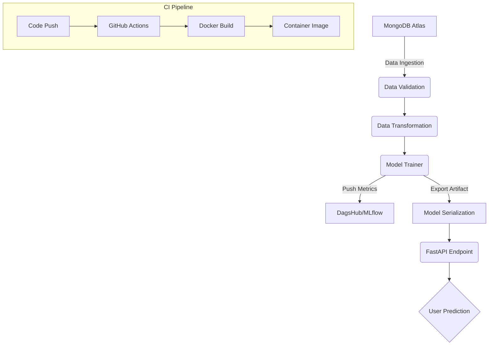

# 🔐 Network Security ML Pipeline with FastAPI & Docker

An **end-to-end Machine Learning CI pipeline** designed to detect malicious network activities. This project focuses on modular code architecture, automated image building, and remote experiment tracking.

---

## 🛠️ Tech Stack

  
  
  
  
  
  
  

- **Core:** Python 3.10, FastAPI, Scikit-learn
- **MLOps:** MLflow (Experiment Tracking), DagsHub (Model Registry)
- **Database:** MongoDB Atlas (NoSQL)
- **DevOps:** Docker (Containerization), GitHub Actions (CI Pipeline)

---

## 🏗️ Project Architecture

